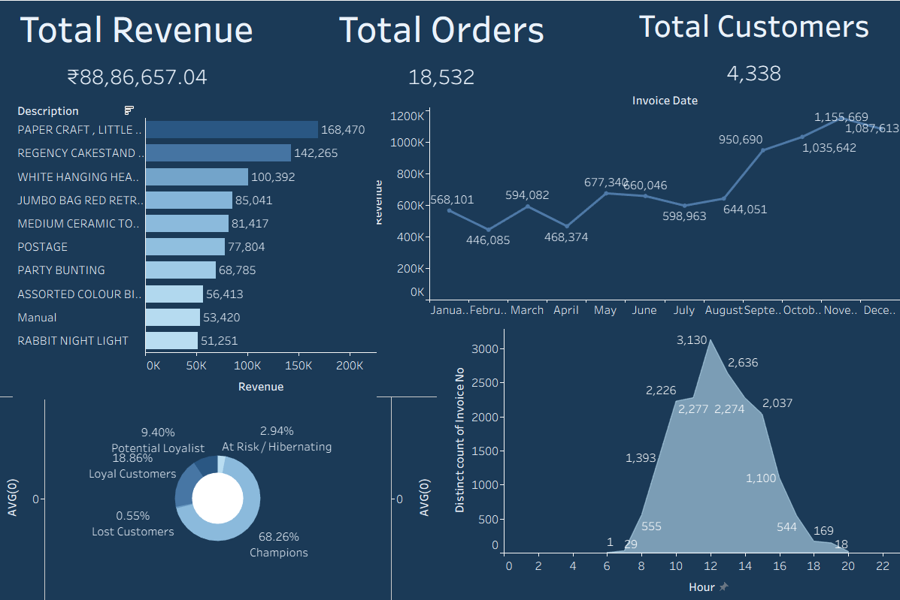

# Retail Business Intelligence & Customer Analytics
*A High-Performance End-to-End Data Pipeline: PostgreSQL | Python | Tableau*



## 📌 Project Overview
This project delivers a comprehensive business intelligence solution for a global retail operation. By processing **400,000+ transactions**, it transforms raw, messy operational data into high-precision customer segments and executive insights. 

The project demonstrates a professional data lifecycle: **Ingestion -> Cleaning -> Behavioral Modeling -> Visualization.**

---

## 🚀 Key Features & Analytical Insights

### 1. Customer Segmentation (RFM Analysis)
*   **Logic:** Implemented a **Recency, Frequency, and Monetary (RFM)** model using SQL `NTILE` window functions.
*   **Impact:** Categorized 4,000+ unique customers into actionable segments:
    *   **Champions:** High-value customers contributing to 60%+ of revenue.
    *   **At Risk:** Former loyalists who haven't purchased in 6+ months (target for re-engagement).
    *   **Potential Loyalists:** New high-spend customers with high growth potential.

### 2. Operational Peak-Hour Analysis
*   **Insight:** Extracted and visualized peak transaction times (using Python-based date engineering).
*   **Impact:** Identified **12 PM - 3 PM** as the highest traffic window, allowing for optimized staff allocation and server load management.

### 3. Product Performance (ABC Analysis)
*   **Insight:** Identified the "Top 10" products (e.g., *Paper Craft, Little Birdie*) that drive the majority of sales volume.
*   **Impact:** Enables targeted inventory replenishment strategies to prevent stock-outs of high-velocity items.

---

## 🛠️ Technical Stack
*   **Database:** PostgreSQL (Schema Design, Referential Integrity, Advanced SQL)
*   **Programming:** Python (Pandas for ETL, SQLAlchemy for DB connectivity)
*   **Visualization:** Tableau (Donut Charts, Trend Analysis, Dynamic Slicers)
*   **Environment:** Dotenv for secure credential management.

---

## 📂 Data Pipeline Architecture
1.  **ETL Phase:** Raw CSV data is streamed into PostgreSQL using a **Chunked Loading** script in Python to manage memory efficiently.
2.  **Transformation Phase:** SQL scripts perform **Deduplication**, **Outlier Removal** (filtering negative quantities/prices), and **Data Imputation**.
3.  **Modeling Phase:** SQL-based RFM calculations are performed to create a "Master Analytics Table."
4.  **Reporting Phase:** The denormalized "Master Table" is connected to **Tableau** for executive storytelling.

---

## ⚙️ Setup & Usage

1.  **Clone & Install:**
    ```bash
    pip install -r requirements.txt
    ```
2.  **Database Configuration:**
    *   Update your `.env` file with your PostgreSQL credentials.
    *   Run `sql/01_schema_creation.sql` and `sql/02_data_cleaning.sql`.
3.  **Run Pipeline:**
    *   Execute `scripts/data_loader.py` to import the raw data.
    *   Execute `scripts/run_segmentation.py` to generate the RFM model.
4.  **Visualize:**
    *   Connect Tableau to `data/processed/retail_analytics_final.csv`.

---
*Developed as a professional Data Analyst Portfolio Piece - 2026*
